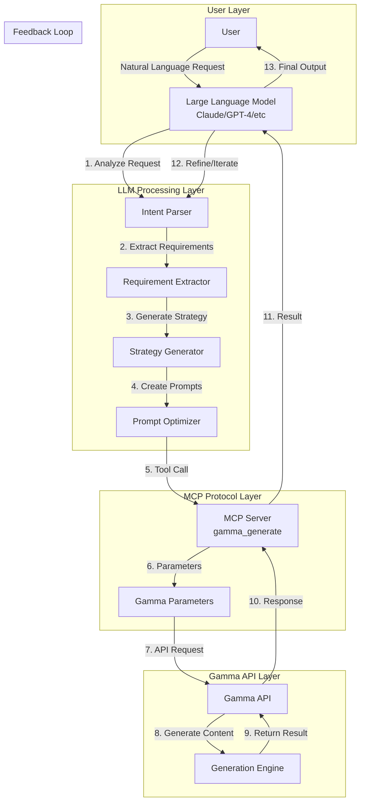

# LLM + Gamma MCP Integration Schema

## Architecture Overview



## Detailed Process Flow

### 1. User Request Processing

```yaml
User Input Example:
  request: "Create a pitch deck for our AI startup focused on healthcare"
  requirements:
    - Professional tone
    - 15 slides
    - Include market analysis
    - Target investors
    - Modern design
```

### 2. LLM Analysis & Parameter Mapping

The LLM analyzes the request and maps it to Gamma API parameters:

```javascript
{
  // LLM interprets "pitch deck" → format: "presentation"
  "format": "presentation",
  
  // LLM interprets "15 slides" → numCards: 15
  "numCards": 15,
  
  // LLM generates comprehensive input text
  "inputText": `
    AI Healthcare Startup Pitch Deck
    
    1. Title: [Company Name] - Revolutionizing Healthcare with AI
    2. Problem: Current healthcare challenges and inefficiencies
    3. Solution: Our AI-powered healthcare platform
    4. Market Opportunity: $X billion healthcare AI market
    5. Product Overview: Key features and capabilities
    6. Technology: Our proprietary AI algorithms
    7. Business Model: SaaS subscription for hospitals
    8. Go-to-Market Strategy: Direct sales and partnerships
    9. Competitive Analysis: Our advantages vs competitors
    10. Traction: Current customers and metrics
    11. Team: Experienced healthcare and AI professionals
    12. Financial Projections: 5-year revenue forecast
    13. Funding Ask: $X million Series A
    14. Use of Funds: Product development and market expansion
    15. Contact: Thank you and next steps
  `,
  
  // LLM maps "professional" + "investors" → specific parameters
  "textOptions": {
    "amount": "detailed",
    "tone": "professional",
    "audience": "investors and venture capitalists",
    "language": "English"
  },
  
  // LLM selects appropriate visual style
  "imageOptions": {
    "source": "aiGenerated",
    "style": "modern corporate",
    "model": "dalle-3"
  },
  
  // LLM infers theme from "modern design"
  "themeName": "tech"
}
```

## Flexibility Points & Control Mechanisms

### A. Content Generation Strategies

```typescript
interface GenerationStrategy {
  // 1. OUTLINE-FIRST APPROACH
  outlineFirst: {
    step1: "Generate detailed outline",
    step2: "Expand each section",
    step3: "Refine with Gamma"
  },
  
  // 2. ITERATIVE REFINEMENT
  iterative: {
    initial: "Basic structure",
    refine1: "Add details",
    refine2: "Polish content",
    refine3: "Optimize visuals"
  },
  
  // 3. TEMPLATE-BASED
  templateBased: {
    template: "Industry-specific template",
    customize: "Fill with user data",
    enhance: "AI-powered improvements"
  }
}
```

### B. LLM Pre-Processing Capabilities

```yaml
1. Content Structuring:
   - Analyze user requirements
   - Create logical flow
   - Ensure narrative coherence
   - Balance text/visual ratio

2. Context Enrichment:
   - Research relevant data
   - Add industry statistics
   - Include best practices
   - Incorporate trends

3. Audience Optimization:
   - Adjust complexity level
   - Tailor messaging
   - Select appropriate examples
   - Match cultural context

4. Visual Planning:
   - Determine image needs
   - Select visual styles
   - Plan data visualizations
   - Design consistency
```

### C. Parameter Flexibility Matrix

| Parameter | LLM Control | User Override | Dynamic Adjustment |
|-----------|-------------|---------------|-------------------|
| `inputText` | Full generation | Templates | Context-aware |
| `textMode` | Smart selection | Manual choice | Based on content |
| `format` | Intent mapping | Explicit request | Use case driven |
| `numCards` | Calculate optimal | Specific number | Content-based |
| `tone` | Analyze context | Direct specify | Audience match |
| `audience` | Infer from request | Define explicitly | Multi-persona |
| `language` | Detect/translate | Set language | Localization |
| `imageSource` | Quality based | Preference | Performance |
| `theme` | Style matching | Brand guides | A/B testing |

## Advanced Integration Patterns

### 1. Multi-Stage Generation Pipeline

```python
class GammaGenerationPipeline:
    def __init__(self, llm, mcp_client):
        self.llm = llm
        self.mcp = mcp_client
    
    async def generate_artifact(self, user_request):
        # Stage 1: Understanding
        intent = await self.llm.analyze_intent(user_request)
        requirements = await self.llm.extract_requirements(intent)
        
        # Stage 2: Planning
        outline = await self.llm.create_outline(requirements)
        content_blocks = await self.llm.expand_outline(outline)
        
        # Stage 3: Optimization
        optimized_content = await self.llm.optimize_for_gamma(
            content_blocks,
            requirements.format,
            requirements.audience
        )
        
        # Stage 4: Generation
        gamma_params = await self.llm.map_to_gamma_params(
            optimized_content,
            requirements
        )
        
        # Stage 5: Execution
        result = await self.mcp.call_tool('gamma_generate', gamma_params)
        
        # Stage 6: Validation
        if await self.needs_refinement(result, requirements):
            return await self.refine_generation(result, requirements)
        
        return result
```

### 2. Dynamic Adaptation Framework

```javascript
const DynamicAdapter = {
  // Analyze content complexity
  assessComplexity(content) {
    const metrics = {
      wordCount: content.split(' ').length,
      concepts: this.extractConcepts(content),
      dataPoints: this.countDataPoints(content),
      visualNeeds: this.assessVisualRequirements(content)
    };
    
    return {
      suggestedCards: Math.ceil(metrics.concepts.length * 1.5),
      textAmount: metrics.wordCount > 1000 ? 'detailed' : 'medium',
      imageStrategy: metrics.visualNeeds.high ? 'aiGenerated' : 'unsplash'
    };
  },
  
  // Optimize for specific use cases
  optimizeForUseCase(useCase, baseParams) {
    const optimizations = {
      'sales_pitch': {
        numCards: 10-12,
        textOptions: { amount: 'brief', tone: 'persuasive' },
        imageOptions: { source: 'aiGenerated', style: 'professional' }
      },
      'educational': {
        numCards: 20-30,
        textOptions: { amount: 'detailed', tone: 'instructional' },
        imageOptions: { source: 'mixed', style: 'informative' }
      },
      'social_media': {
        format: 'social',
        numCards: 5-7,
        textOptions: { amount: 'brief', tone: 'engaging' },
        imageOptions: { source: 'giphy', style: 'trendy' }
      }
    };
    
    return { ...baseParams, ...optimizations[useCase] };
  }
};
```

### 3. Feedback Loop Integration

```typescript
interface FeedbackLoop {
  // Analyze generation quality
  qualityMetrics: {
    contentCompleteness: number;  // 0-1 score
    visualAppeal: number;         // 0-1 score
    audienceAlignment: number;    // 0-1 score
    objectiveMet: boolean;
  };
  
  // Refinement strategies
  refinementActions: {
    lowCompleteness: "Add missing sections via textMode: 'preserve'",
    poorVisuals: "Regenerate with different imageOptions",
    wrongAudience: "Adjust tone and language parameters",
    objectiveUnmet: "Restructure content with new inputText"
  };
  
  // Iteration control
  maxIterations: 3;
  improvementThreshold: 0.8;
}
```

## Real-World Implementation Examples

### Example 1: Technical Documentation Generator

```javascript
async function generateTechnicalDocs(apiSpec) {
  const llm_analysis = await llm.analyze({
    task: "Create technical documentation",
    input: apiSpec,
    requirements: {
      completeness: "high",
      accuracy: "critical",
      examples: "required"
    }
  });
  
  const gamma_params = {
    inputText: llm_analysis.structured_content,
    format: "document",
    textMode: "generate",
    numCards: Math.ceil(apiSpec.endpoints.length * 2),
    textOptions: {
      amount: "detailed",
      tone: "technical",
      audience: "developers",
      language: "English"
    },
    imageOptions: {
      source: "none",  // Code snippets as text
    },
    themeName: "minimal"
  };
  
  return await mcp.gamma_generate(gamma_params);
}
```

### Example 2: Marketing Campaign Builder

```javascript
async function createMarketingCampaign(brand, campaign) {
  // LLM creates multi-format content
  const formats = ['presentation', 'social', 'document'];
  const results = {};
  
  for (const format of formats) {
    const adapted_content = await llm.adaptContent({
      original: campaign.core_message,
      format: format,
      brand_voice: brand.guidelines,
      platform_requirements: getPlatformReqs(format)
    });
    
    results[format] = await mcp.gamma_generate({
      inputText: adapted_content,
      format: format,
      textOptions: {
        tone: brand.tone,
        audience: campaign.target_audience
      },
      imageOptions: {
        source: 'aiGenerated',
        style: brand.visual_style
      }
    });
  }
  
  return results;
}
```

## Optimization Strategies

### 1. Prompt Engineering for Gamma

```yaml
Optimal InputText Structure:
  1. Clear Headers: Use markdown-style headers
  2. Bullet Points: For easy parsing
  3. Logical Flow: Sequential narrative
  4. Keywords: SEO and clarity
  5. Calls-to-Action: Where appropriate

Example Template:
  "# [Main Title]
   
   ## Section 1: [Topic]
   - Key point 1
   - Key point 2
   - Supporting data: [specific numbers]
   
   ## Section 2: [Topic]
   [Detailed explanation]
   
   ### Subsection 2.1
   - Implementation details
   - Best practices
   
   ## Conclusion
   - Summary points
   - Next steps
   - Contact information"
```

### 2. Performance Optimization

```javascript
const PerformanceOptimizer = {
  // Batch similar requests
  batchRequests(requests) {
    return requests.reduce((batches, req) => {
      const key = `${req.format}-${req.audience}-${req.tone}`;
      batches[key] = batches[key] || [];
      batches[key].push(req);
      return batches;
    }, {});
  },
  
  // Cache common patterns
  cacheStrategy: {
    templates: new Map(),
    outlines: new Map(),
    themes: new Map()
  },
  
  // Parallel processing
  async processMultiple(requests) {
    const promises = requests.map(req => 
      this.optimizeAndGenerate(req)
    );
    return Promise.all(promises);
  }
};
```

## Error Handling & Recovery

```typescript
class GammaErrorHandler {
  async handleGenerationError(error, originalParams) {
    switch(error.type) {
      case 'CONTENT_TOO_LONG':
        // Split into multiple generations
        return this.splitGeneration(originalParams);
        
      case 'INVALID_FORMAT':
        // Fallback to supported format
        return this.fallbackFormat(originalParams);
        
      case 'RATE_LIMIT':
        // Queue and retry
        return this.queueWithBackoff(originalParams);
        
      case 'CONTENT_POLICY':
        // Rephrase problematic content
        return this.sanitizeContent(originalParams);
        
      default:
        // Generic retry with modified params
        return this.genericRetry(originalParams);
    }
  }
}
```

This architecture provides maximum flexibility while maintaining quality and consistency in artifact generation. The LLM acts as an intelligent orchestrator that can adapt to any requirement while the Gamma API provides the rendering engine.